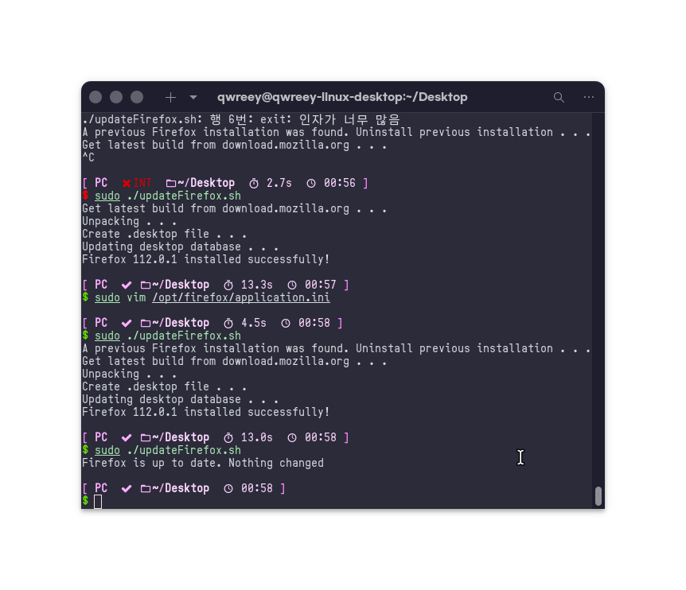

# What it is?

Firefox's main upstream(https://download.mozilla.org) doesn't provide deb files or rpm files.

This script can update/install Firefox automatically from the main upstream.



# Using with curl (direct)

Simply just type this in your terminal.

```sh
curl https://raw.githubusercontent.com/qwreey75/updateFirefox.sh/master/updateFirefox.sh -s | sudo bash
```

# Copying updateFirefox.sh

Just copy, and run it
